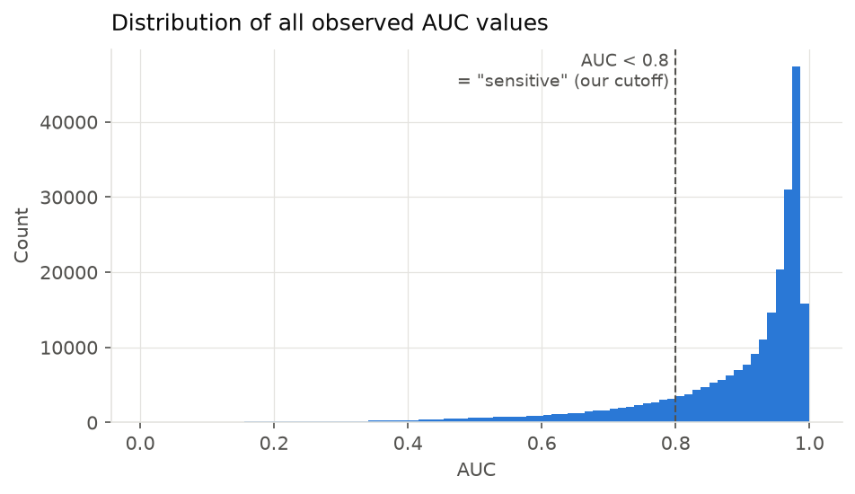
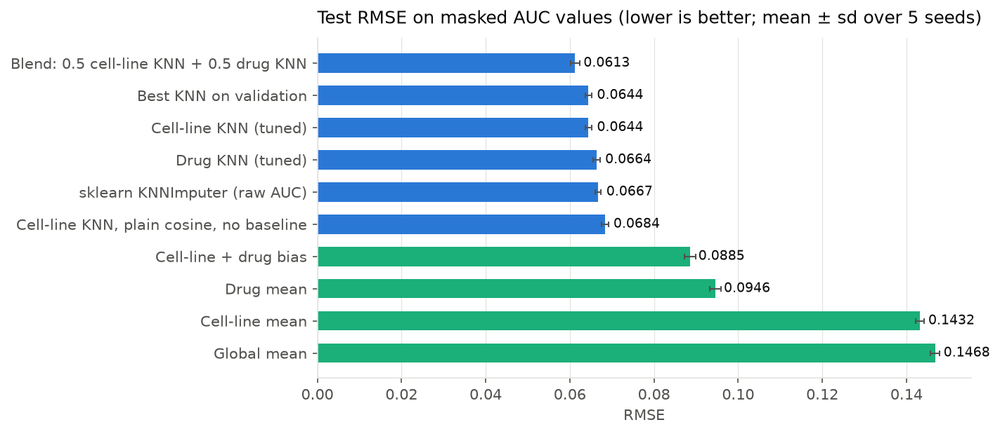
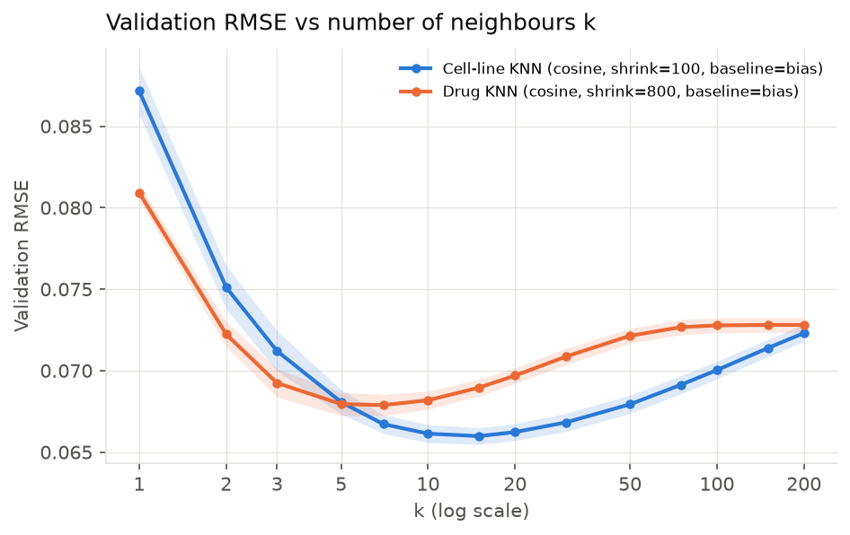
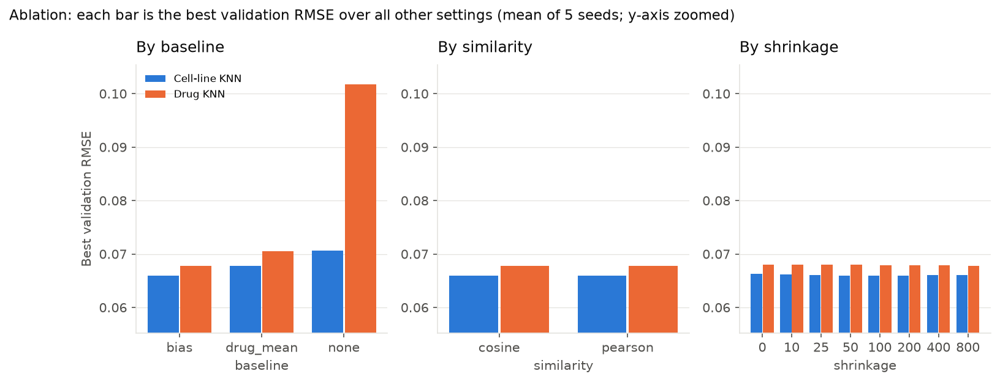
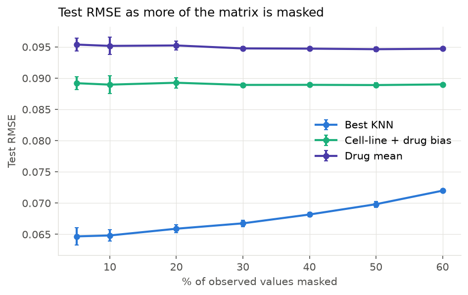
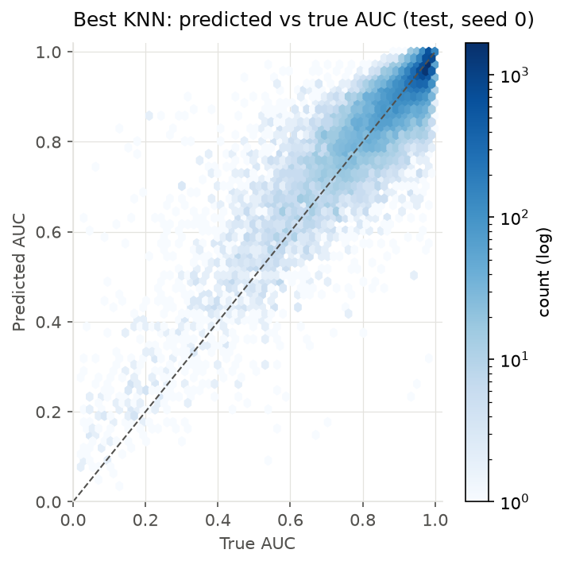
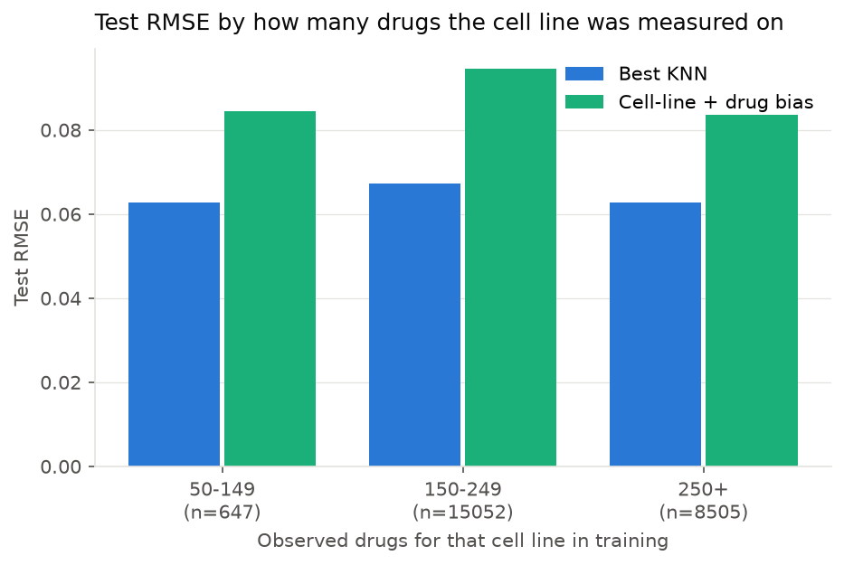

# KNN collaborative filtering for GDSC2 drug response (AUC)

Treat the GDSC2 AUC matrix (969 cancer cell lines × 295 drugs) like a user × item
rating matrix. **Randomly hide some measured AUC values, predict them with KNN, and
score the predictions with RMSE.**

## TL;DR

| Method (test set, 5 seeds) | RMSE ↓ | vs. drug-mean baseline |
|---|---|---|
| Drug mean (predict each drug's average AUC) | 0.0946 ± 0.0014 | – |
| Cell-line + drug bias (`μ + b_cell + b_drug`) | 0.0885 ± 0.0013 | −6% |
| sklearn `KNNImputer` on raw AUC | 0.0667 ± 0.0007 | −30% |
| **Cell-line KNN, tuned** | **0.0644 ± 0.0008** | **−32%** |
| Drug KNN, tuned | 0.0664 ± 0.0008 | −30% |
| 0.5 × cell-line KNN + 0.5 × drug KNN | 0.0613 ± 0.0011 | −35% |

* KNN clearly works: it cuts error by about a third compared with the per-drug average.
* **Cell-line KNN** (find cell lines that respond like this one) beats **drug KNN**
  (find drugs that act like this one). All 5 seeds independently picked the same
  settings: bias baseline, k = 15, shrinkage 100–200.
* The biggest single choice is **predicting residuals from a baseline** rather than
  raw AUC. Similarity type (cosine vs Pearson) makes no measurable difference.
* Caveat: most AUCs are ~0.95 (the drug does nothing), so RMSE is dominated by easy
  cases. On the entries where the drug *does* work (AUC < 0.8), RMSE is **0.117**,
  about 2.6× the error on the rest. See [Things to be aware of](#things-to-be-aware-of).

Full tables are in [`results/summary.md`](results/summary.md) and figures in [`figures/`](figures/).

## How to run

```bash
uv venv .venv && uv pip install -p .venv -r requirements.txt   # or: python -m venv .venv && pip install -r requirements.txt
.venv/bin/python -m pytest -q                                   # 10 tests, ~5 s
.venv/bin/python run_experiments.py                             # full study, ~25 min on a laptop
.venv/bin/python run_experiments.py --figures-only              # redraw figures from results/*.csv
```

Every random choice is seeded, so re-running reproduces the numbers exactly.

## Data

`data/cancer_cell_line_drug_auc_matrix.csv`: rows = cell lines, columns = GDSC drug IDs, values = AUC.

| | |
|---|---|
| Shape | 969 cell lines × 295 drugs |
| Observed values | 242,036 (15.3% missing) |
| AUC | mean 0.883, median 0.944, range 0.006–0.999 |
| AUC < 0.8 ("sensitive") | 18.3% of values |
| AUC > 0.9 | 64.8% of values |
| Drugs per cell line | min 12, median 279 |
| Cell lines per drug | min 225, median 893 |

Lower AUC = more cells killed = cell line is more sensitive to the drug.



## Method

### Masking protocol (the part that makes the RMSE trustworthy)

For each of 5 random seeds:

1. Take all **observed** entries (never the NaNs; there's no ground truth for those).
2. Hide a random **10% as test** and a different random **10% as validation**. The remaining 80% is training.
3. Try every KNN configuration on train and score it on **validation**.
4. Pick the configuration with the lowest validation RMSE.
5. Put the validation values back, refit on train + validation, and score **once on test**.

The test entries are never used to choose anything, including k. Choosing k by
looking at test RMSE would make the number optimistic. A unit test also checks
that changing a hidden value never changes its own prediction (no leakage).

### KNN model (`src/knn_cf.py`)

Two flavours:

* **Cell-line KNN** (user-based). To predict AUC(cell line *i*, drug *j*), take the *k*
  cell lines most similar to *i* **that were measured on drug *j***, and average their
  AUC on *j*, weighted by similarity.
* **Drug KNN** (item-based). The same idea with drugs: take the *k* drugs most similar
  to *j* that cell line *i* was measured on.

Prediction with a baseline (Koren, 2010):

```
r̂(i,j) = b(i,j) + Σ_v s(i,v) · (r(v,j) − b(v,j)) / Σ_v s(i,v)
b(i,j) = μ + b_cell(i) + b_drug(j)          (regularised, fitted on train only)
```

The neighbours vote on *how much more or less sensitive than expected* a cell line
is, not on the raw AUC. Without this, a neighbour's AUC mostly reflects how toxic
the drug is in general, which the drug mean already captures.

Details:
* Similarity (cosine or Pearson) is computed only over drugs both cell lines were measured on.
* **Shrinkage**: `s ← s · n_common / (n_common + λ)` down-weights similarities based on few shared drugs.
* Only positively similar neighbours vote. If no neighbour is available, the prediction falls back to the bias baseline.
* Predictions are clipped to [0, 1].

### Search grid (tuned on validation)

| Setting | Values |
|---|---|
| kind | cell-line, drug |
| similarity | cosine, Pearson |
| shrinkage λ | 0, 10, 25, 50, 100, 200, 400, 800 |
| baseline | bias (`μ+b_cell+b_drug`), drug mean, none (raw AUC) |
| k | 1, 2, 3, 5, 7, 10, 15, 20, 30, 50, 75, 100, 150, 200 |

That is 96 fitted models × 14 values of k = 1,344 configurations per seed.

### Comparisons

* **Baselines**: global mean, cell-line mean, drug mean, cell-line + drug bias.
* **sklearn `KNNImputer`** on the raw matrix (distance-weighted, k tuned on validation from 5/10/20/40): the simplest off-the-shelf KNN.
* **Plain KNN**: cell-line KNN, raw AUC, cosine, no shrinkage (k tuned). This shows what the baseline and shrinkage add.
* **Blend**: the average of the tuned cell-line and drug KNN predictions (fixed 50/50 weight, not tuned).

### Metrics (`src/metrics.py`)

* **RMSE**: the main metric. **MAE** and **Pearson r** as secondary checks.
* **RMSE split by true AUC < 0.8 vs ≥ 0.8**: checks whether the model gets the cases where the drug works right.
* **Mean Spearman within each cell line**: are a cell line's held-out drugs put in the right order? That matters if the predictions are later used to rank drugs.

## Results

### Test set (mean ± sd over 5 seeds)

| Method | RMSE | MAE | Pearson r | RMSE (AUC<0.8) | RMSE (AUC≥0.8) | Spearman within cell line |
|---|---|---|---|---|---|---|
| Blend: 0.5 cell-line KNN + 0.5 drug KNN | 0.0613 ± 0.0011 | 0.0372 ± 0.0003 | 0.909 ± 0.002 | 0.110 ± 0.003 | 0.0434 ± 0.0003 | 0.808 ± 0.004 |
| Cell-line KNN (tuned) = best on validation | 0.0644 ± 0.0008 | 0.0399 ± 0.0002 | 0.899 ± 0.002 | 0.117 ± 0.003 | 0.0452 ± 0.0003 | 0.805 ± 0.005 |
| Drug KNN (tuned) | 0.0664 ± 0.0008 | 0.0406 ± 0.0003 | 0.893 ± 0.002 | 0.116 ± 0.003 | 0.0487 ± 0.0008 | 0.767 ± 0.004 |
| sklearn KNNImputer (raw AUC, k=10) | 0.0667 ± 0.0007 | 0.0397 ± 0.0002 | 0.894 ± 0.002 | 0.129 ± 0.002 | 0.0415 ± 0.0004 | 0.801 ± 0.004 |
| Cell-line KNN, plain cosine, no baseline | 0.0684 ± 0.0008 | 0.0406 ± 0.0002 | 0.891 ± 0.001 | 0.135 ± 0.003 | 0.0408 ± 0.0004 | 0.799 ± 0.006 |
| Cell-line + drug bias | 0.0885 ± 0.0013 | 0.0575 ± 0.0006 | 0.798 ± 0.004 | 0.162 ± 0.004 | 0.0611 ± 0.0004 | 0.742 ± 0.004 |
| Drug mean | 0.0946 ± 0.0014 | 0.0573 ± 0.0005 | 0.765 ± 0.005 | 0.180 ± 0.004 | 0.0611 ± 0.0006 | 0.742 ± 0.004 |
| Cell-line mean | 0.1432 ± 0.0010 | 0.0995 ± 0.0006 | 0.221 ± 0.006 | 0.291 ± 0.002 | 0.0791 ± 0.0002 | – |
| Global mean | 0.1468 ± 0.0011 | 0.1032 ± 0.0006 | – | 0.304 ± 0.002 | 0.0758 ± 0.0001 | – |

"–" means the metric is undefined because the method predicts one constant value per cell line or overall.



### Settings chosen on validation

| seed | kind | similarity | shrinkage | baseline | k |
|---|---|---|---|---|---|
| 0 | cell-line | Pearson | 200 | bias | 15 |
| 1 | cell-line | Pearson | 100 | bias | 15 |
| 2 | cell-line | cosine | 100 | bias | 15 |
| 3 | cell-line | Pearson | 100 | bias | 15 |
| 4 | cell-line | cosine | 200 | bias | 15 |

The choice is very stable. The follow-up analyses below use
**cell-line KNN, Pearson, λ = 100, bias baseline, k = 15**.

### How many neighbours?



* k = 1 is poor (RMSE ≈ 0.087): one neighbour is too noisy.
* Cell-line KNN is best around k = 10–20. Drug KNN is best around k = 5–7, then gets worse as dissimilar drugs start voting.
* The shaded band (±1 sd across seeds) is narrow, so the curve shape is reliable.

### What each setting contributes



* **Baseline matters most**, especially for drug KNN. Using raw AUC (no baseline) pushes drug KNN from 0.068 to 0.10.
* **Cosine vs Pearson makes no difference.** After subtracting the baseline, each cell line's residuals already average close to zero, so the two formulas nearly coincide.
* **Shrinkage helps only slightly** (cell-line KNN: 0.0663 at λ = 0 → 0.0660 at λ = 100). 94% of cell-line pairs share more than 150 drugs, so few similarities rest on thin evidence.

### Does it hold up when more data is hidden?



| % masked | KNN | bias | drug mean |
|---|---|---|---|
| 5 | 0.0647 | 0.0892 | 0.0954 |
| 10 | 0.0648 | 0.0890 | 0.0952 |
| 20 | 0.0659 | 0.0893 | 0.0952 |
| 30 | 0.0668 | 0.0889 | 0.0948 |
| 40 | 0.0682 | 0.0889 | 0.0947 |
| 50 | 0.0698 | 0.0889 | 0.0946 |
| 60 | 0.0720 | 0.0890 | 0.0947 |

KNN degrades gracefully. With 60% of the measured values hidden, it still beats the baselines by about 20%.

### Where the errors are



| True AUC | n (test, seed 0) | KNN RMSE | bias RMSE |
|---|---|---|---|
| < 0.5 | 834 | 0.185 | 0.291 |
| 0.5–0.7 | 1,627 | 0.121 | 0.156 |
| 0.7–0.8 | 1,945 | 0.080 | 0.084 |
| 0.8–0.9 | 4,099 | 0.060 | 0.069 |
| 0.9–0.95 | 4,319 | 0.047 | 0.064 |
| 0.95–1 | 11,380 | 0.037 | 0.058 |

**Predictions shrink toward the average.** Very sensitive cases (true AUC < 0.5) are
predicted too high, by 0.12 on average, which shows as points above the diagonal on the left of the plot.
KNN still reduces that error by 36% compared with the baseline, but these are the
cases where most of the remaining error sits.



Error barely depends on how many drugs a cell line was measured on. Every cell line
in the test sample had at least 85 training measurements. Only 2 of the 969 cell
lines have fewer than 50 in total (HCC202: 14, RH-18: 12), and neither appeared in
the seed-0 test sample.

The hardest drugs (`results/error_by_drug.csv`) are those whose AUC varies a lot
between cell lines, for example drug IDs 1248, 1819 and 1617. Across drugs, KNN
error and the spread of true AUC correlate at r = 0.93.

## Things to be aware of

1. **A small RMSE is partly an artefact of the data.** 65% of AUCs are above 0.9, so
   predicting a value near 0.95 is right most of the time. Always quote RMSE next to
   the drug-mean baseline, and preferably next to the AUC < 0.8 RMSE.
2. **`KNNImputer` looks competitive on overall RMSE (0.0667), but on the sensitive
   cases it is clearly worse than tuned KNN (0.129 vs 0.117).** It does better on the
   easy near-1 values (0.0415 vs 0.0452). The only model worse on sensitive cases is
   the plain no-baseline KNN (0.135). Working from a baseline is what helps the cases
   that matter.
3. **Random masking is the easy setting.** A hidden entry's cell line and drug both
   still have plenty of other measurements. Predicting a brand-new cell line or drug
   (cold start) would be much harder, and this experiment does not test it.
4. **The blend's weight was fixed at 50/50 beforehand, not tuned**, so its test result
   is fair. However, it was added as an extra and was not part of the validation-based
   selection.
5. Drug KNN's validation RMSE was still very slightly improving at λ = 800, the top of
   the grid (0.06785 at λ = 400 → 0.06780 at λ = 800, mean over seeds). The difference
   is negligible and does not change any conclusion.
6. "Pearson" here uses the common shortcut: each cell line's values are centred on its
   own mean over all its measured drugs, not only the drugs it shares with the other
   cell line. Cosine and Pearson gave the same results anyway.

## Files

```
data/cancer_cell_line_drug_auc_matrix.csv   input matrix
src/masking.py        random train / val / test hiding of observed entries
src/baselines.py      global / cell-line / drug mean, regularised bias baseline
src/knn_cf.py         cell-line and drug KNN with baseline, shrinkage, multi-k prediction
src/metrics.py        RMSE, MAE, Pearson, sensitive-subset RMSE, per-cell-line Spearman
tests/test_pipeline.py  split correctness, no leakage, sanity checks on toy data
run_experiments.py    the whole study → results/ and figures/
results/summary.md                  all tables in one place
results/test_results_per_seed.csv   every method × seed × metric
results/validation_grid.csv         every configuration's validation RMSE (all seeds)
results/chosen_config_per_seed.csv  what validation picked
results/mask_fraction_sweep.csv     RMSE vs % masked
results/test_predictions_seed0.csv  every test prediction (cell line, drug, true, predicted)
results/error_by_*.csv              error breakdowns
figures/*.png                       the plots above
```

## References

* Koren, Y. (2010) 'Factor in the neighbors: Scalable and accurate collaborative filtering', *ACM Transactions on Knowledge Discovery from Data*, 4(1), pp. 1–24.
* Yang, W. et al. (2013) 'Genomics of Drug Sensitivity in Cancer (GDSC): a resource for therapeutic biomarker discovery in cancer cells', *Nucleic Acids Research*, 41(D1), pp. D955–D961.
* Troyanskaya, O. et al. (2001) 'Missing value estimation methods for DNA microarrays', *Bioinformatics*, 17(6), pp. 520–525. (The KNN imputation method behind `KNNImputer`.)
